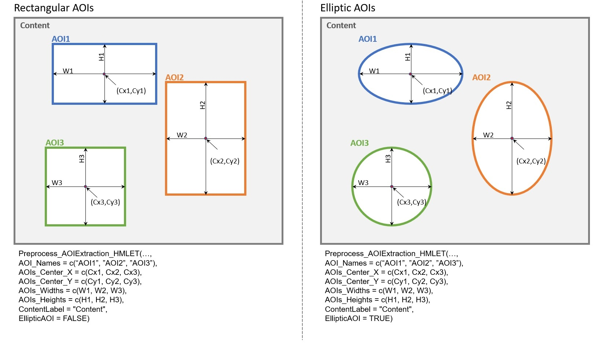

### Data Preparation

Prepare your data in **long format** to include `GazeX` and `GazeY` coordinates for each gaze point at each line. For AOI extraction, you need to identify the coordinates of the center of each AOI, as well as their width and height. By default, AOIs will be computed in a **rectangular** format. Alternatively, you can define **elliptic** AOIs, in which height and width will be counted as the vertical and horizontal diameters of the ellipse. 

See the attached pictures for more details.

### Installation

First, install the following packages in R:

```r
devtools::install_github("xtensor-stack/Xtensor.R")
devtools::install_github("r-lib/rray")
```
Next, install the latest version of HMLET:

```r
devtools::install_github("Alireza-Kazemi/HMLET/RPackage/HMLET")
```
### Function Call
You can call the function as follows:

```r
library(HMLET)

Preprocess_AOIExtraction_HMLET(
  data,
  GazeX,
  GazeY,
  AOI_Names,
  AOIs_Center_X,
  AOIs_Center_Y,
  AOIs_Widths,
  AOIs_Heights,
  ContentLabel = "Content",
  EllipticAOI = FALSE)
  
  
# 	data				long format dataframe containing temporal data.
#	GazeX 				string for column name that includes X coordinate of gazepoints
#	GazeY 				string for column name that includes Y coordinate of gazepoints
#	AOI_Names 			List of Strings for AOIs names
#	AOIs_Center_X 		List of numerical values for the horizontal coordinate of the center of all AOIs
#						or list of strings indicating the column names in the input data that have these
#						values
#	AOIs_Center_Y 		List of numerical values for the vertical coordinate of the center of all AOIs
#						or list of strings indicating the column names in the input data that have these
#						values
#	AOIs_Radius_X 		List of numerical values for width size/horizontal diameter of all AOIs or list of
#						strings indicating the column names in the input data that have these values
#	AOIs_Radius_Y 		List of numerical values for height size/vertical diameter of all AOIs or list of
#						strings indicating the column names in the input data that have these values.
#	ContentLabel 		Label for gaze points that are outside all of the AOIs, defaults to "Content"
#	EllipticAOI 		Binary value to identify whether elliptic AOIs should be used instead of rectangular ones, defaults to FALSE

 ```

