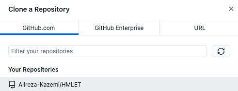
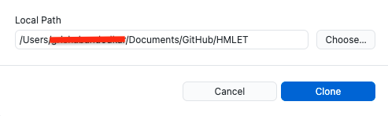
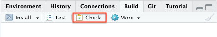
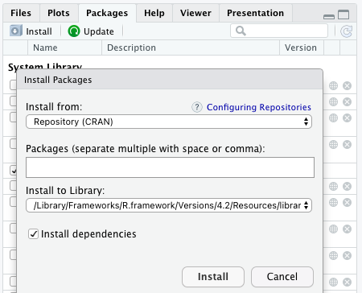
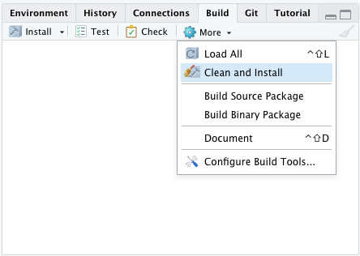
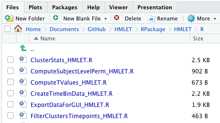
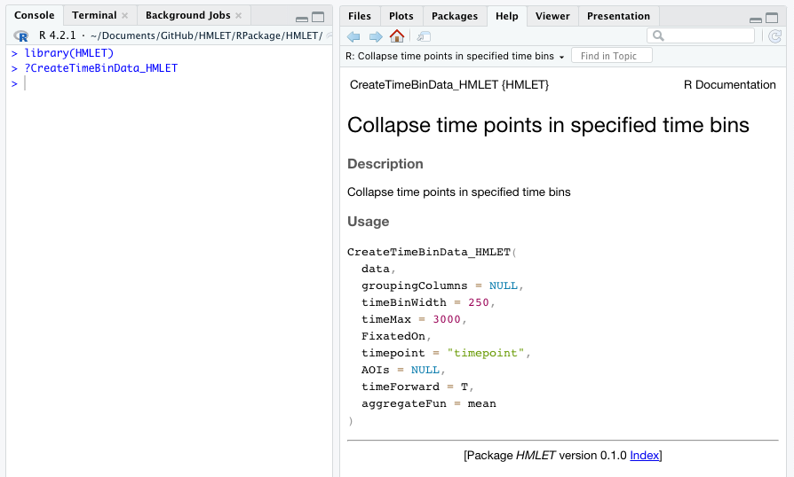

# HMLET Installation Guide for Developers

## Applications
* Github Desktop
* RStudio 

## Install the Project on your local device 
###### Github Desktop
1. File > Clone Repository 
2. Select the HMLET Repository and choose a path to store the project locally. 



###### RStudio 
1. File > Open Project in New Session... > [Local Path]/HMLET/RPackage/HMLET/HMLET.Proj
2. In the top right panel, Select Build > Check

3. Install any missing dependencies using Packages in the bottom right panel. 

4. If you see this error: `ERROR: dependency 'rray' is not available for package 'HMLET'`, run this command within the RStudio console of the project: `remotes::install_github("r-lib/rray")`
5. Run Clean + Install within More under Build in top right panel. 

6. If there was an error during installation, remove HMLET.Rcheck directory and the HMLET tar.gz file. 

## Access documentation for a function within HMLET 
1. Within the bottom right panel under Files, open all the files that define the functions under HMLET/R. These file names math the name of its corresponding function. 

2. Within the console of RStudio enter these commands to retrieve documentation for a function:
```
library(HMLET)
?[functionName]
```

